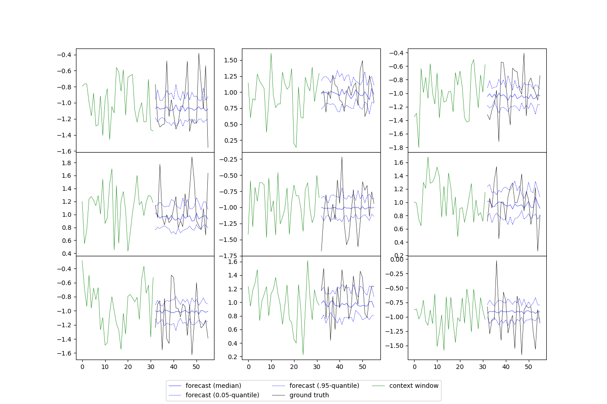
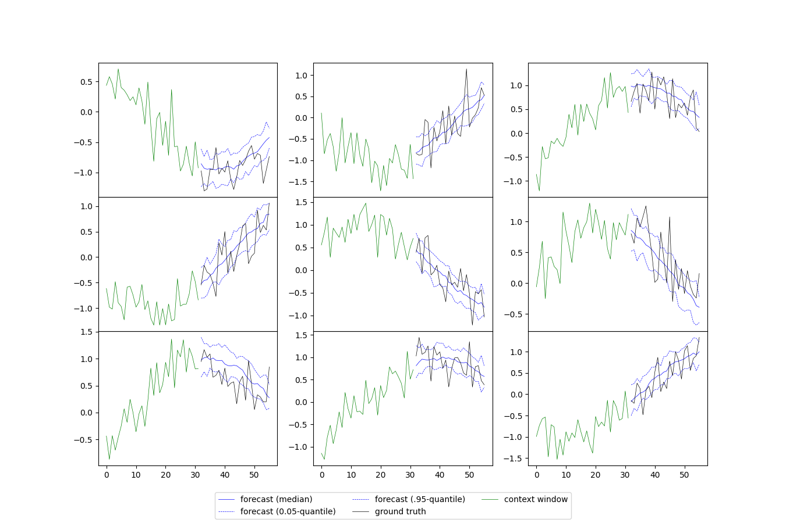
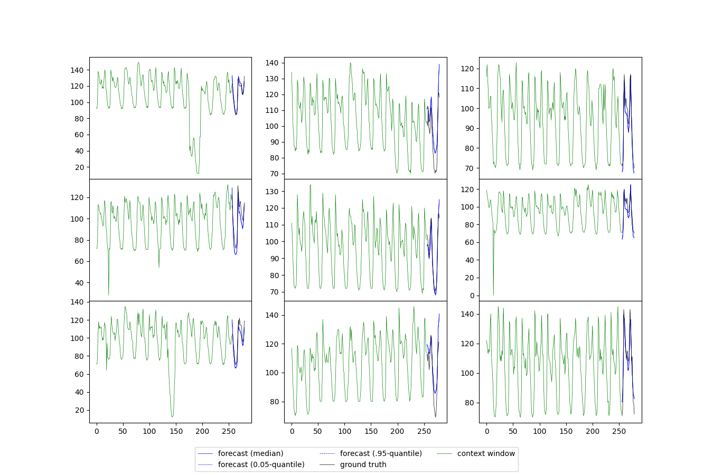

# Project Duru: Hierarchical VAEs and diffusions for forecasting and anomaly detection

This repository contains the source code of 'Project Duru: Hierarchical VAEs (HVAEs) and diffusions for forecasting and anomaly detection'.
At present, the repository contains:

* Two working implementations of a conditional VDVAE [1] model for time-series forecasting based on a fully-connected and convolutional architecture.
* Implementations of a simple "two Gaussian" dataset, a sine wave dataset, and all gluonts datasets within an appropriate training pipeline
* Logging of plots and metrics to supervise the optimization process and analyse results, e.g. ELBO, distortion, rate, NaN counts, reconstruction plots, prediction plots, a test routine based on the gluonts `Evaluator` class, ...

All hyperparameters are extensively explained in the help strings of the command line arguments in `hyperparams.py`.
This source code partly builds on top of the [official implementation of VDVAE](https://github.com/openai/vdvae) and a previously developed implementation of VDVAE by the author of this repository.

The source code is in a preliminary state, and it will be refined as the project matures.

[1] Child, R., 2020. Very deep vaes generalize autoregressive models and can outperform them on images. arXiv preprint arXiv:2011.10650.

## Installation

Please set up a virtual environment installing the following key dependencies: 

```shell
pip install torch torchvision
pip install pickle5
pip install lmdb
pip install imageio
pip install mpi4py
pip install sklearn
pip install matplotlib
pip install pyyaml
pip install wandb
pip install gluonts
```

In `setup/wandb.yml`, you need to provide your wandb login credentials. 
Other loggers can likewise be used, if desired.

## How to run

In the following, we provide exemplary runs on three datasets which demonstrate our implementation: 

### Two-Gaussian dataset: 

```shell
CUDA_VISIBLE_DEVICES=0 python main.py --device cuda --enc_spec "1" --enc_context_spec "1" --dec_spec "1" --enc_forecast_state_dim_input 32 --enc_context_state_dim_input 32 --dec_state_dim_input 32 --batch_size 100 --lr 0.001 --adam_weight_decay 0.01 --adam_weight_decay 0.01 --grad_clip_threshold -1 --grad_skip_threshold -1 --model vdvae_fc --likelihood_type GaussianSigmaHyperparam --sigma_p_x_z 0.01 --context_length 32 --forecast_length 24 --iters_per_vis 2000 --iters_per_val 2000 --dataset 2gauss --val_windows_per_item 3 --normalize per_ts_standardize
```



### Sine wave dataset: 

```shell
CUDA_VISIBLE_DEVICES=0 python main.py --device cuda --enc_spec "1" --enc_context_spec "1" --dec_spec "1" --enc_forecast_state_dim_input 32 --enc_context_state_dim_input 32 --dec_state_dim_input 32 --batch_size 100 --lr 0.001 --adam_weight_decay 0.01 --adam_weight_decay 0.01 --grad_clip_threshold -1 --grad_skip_threshold -1 --model vdvae_fc --likelihood_type GaussianSigmaHyperparam --sigma_p_x_z 0.01 --context_length 32 --forecast_length 24 --iters_per_vis 2000 --iters_per_val 2000 --dataset sine --val_windows_per_item 10 --normalize per_ts_standardize
```



### Electricity dataset (single item training): 

```shell
CUDA_VISIBLE_DEVICES=0 python main.py --device cuda --context_length 256 --forecast_length 24 --enc_spec "3,d2,3,d2,3" --enc_context_spec "3,d2,3,d2,3" --dec_spec "3,u2,3,u2,3" --model vdvae_fc --enc_forecast_state_dim_input 256 --enc_context_state_dim_input 512 --dec_state_dim_input 512 --batch_size 100 --lr 0.001 --adam_weight_decay 0.01 --z_channels 8 --adam_weight_decay 0.01 --grad_clip_threshold -1 --grad_skip_threshold -1  --likelihood_type GaussianSigmaEstimated --iters_per_vis 2000 --iters_per_val 2000 --dataset electricity --single_item True --chosen_id 1 --val_windows_per_item 10
```



