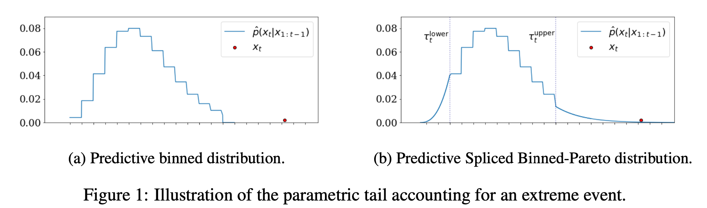
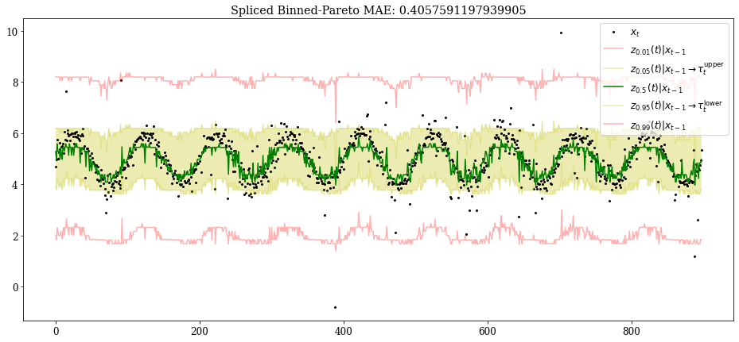
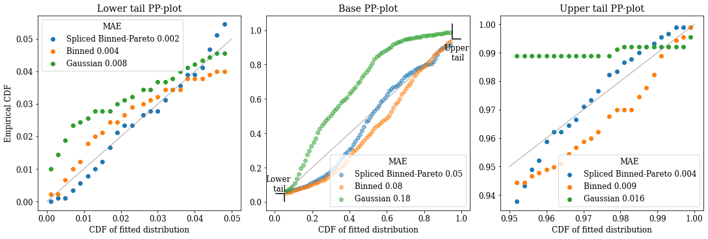

## Spliced Binned-Pareto distribution

Spliced Binned-Pareto distribution which both handles extreme observations and allows accurate capture of the full distribution, to robustly and accurately model time series with heavy-tailed noise, in non-stationary scenarios. In many practical application time series have heavy-tailed noise that significantly impacts the performance of classical forecasting models; in particular, accurately modeling a distribution over extreme events is crucial to performing accurate time series anomaly detection. The Spliced Binned-Pareto allows the capture of time dependencies in the higher order moments of the distribution such as the tail heaviness.

The notebook run_model_example.ipynb is an example how to
(a) use a DistributionalTCN to fit a Spliced Binned-Pareto distribution to given data, and 
(b) compare the Spliced Binned-Pareto distribution fit to other distributions' fits.

    

    

    

Accuracy of the density estimation of each of the method is evaluated using Probability-Probability (PP) plots (PP-plots). For a given quantile level q, we compute y_q the fraction of points that fell below the given quantile z_q{(t)} of their corresponding predictive distribution. To obtain a quantitative score, we measure how good the tail estimate is by computing the Mean Absolute Error (MAE) between  y_q and q for all measured quantiles q.

 **Mean Absolute Error (MAE):**
 
| Lower tail |	Base |	Upper tail |	Full distribution |
| ----------- | ----------- | ----------- | ----------- |
| Spliced Binned-Pareto |	0.006065 |	0.060795 |	0.006990 |	0.039797 |
| Binned |	0.006219 |	0.083699 |	0.007573 |	0.053911 |
| Gaussian |	0.105969 |	0.381656 |	0.022285 |	0.259667 |

    

    

